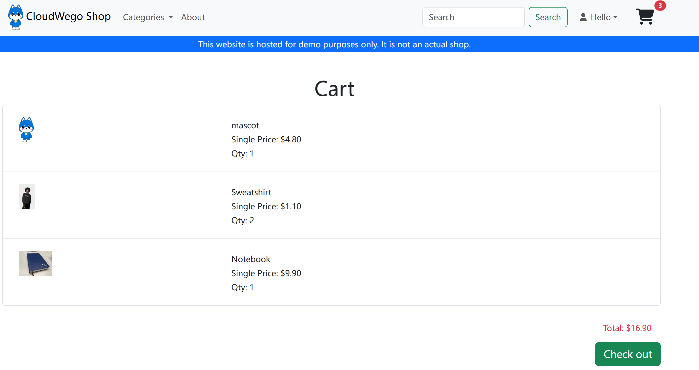
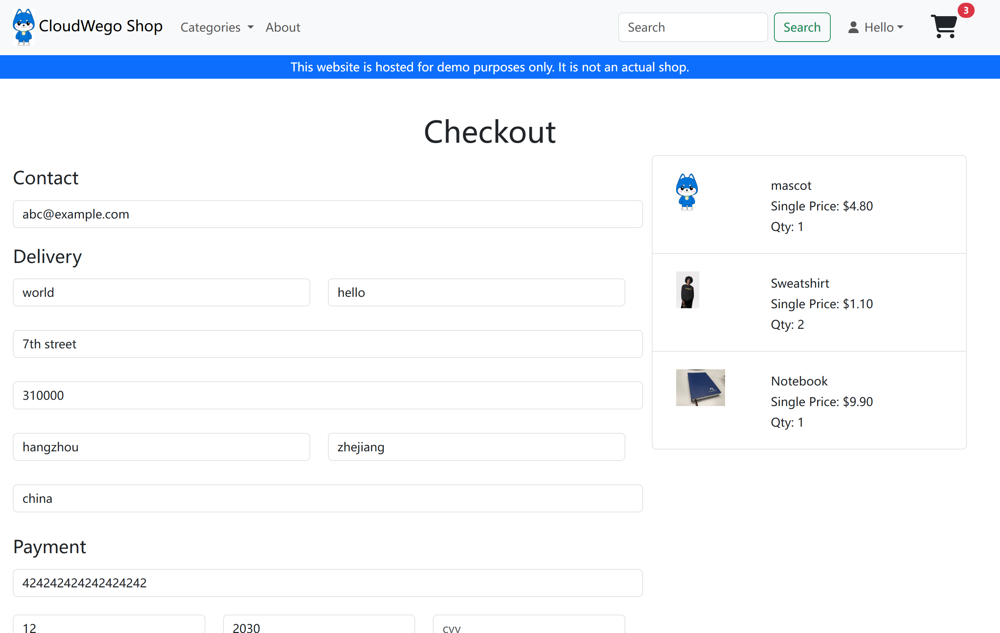
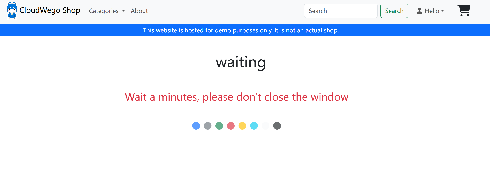
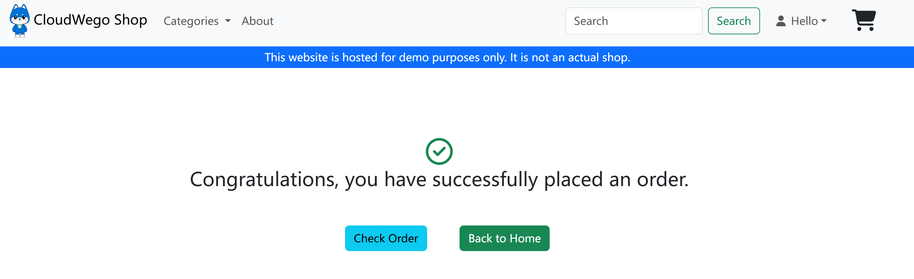
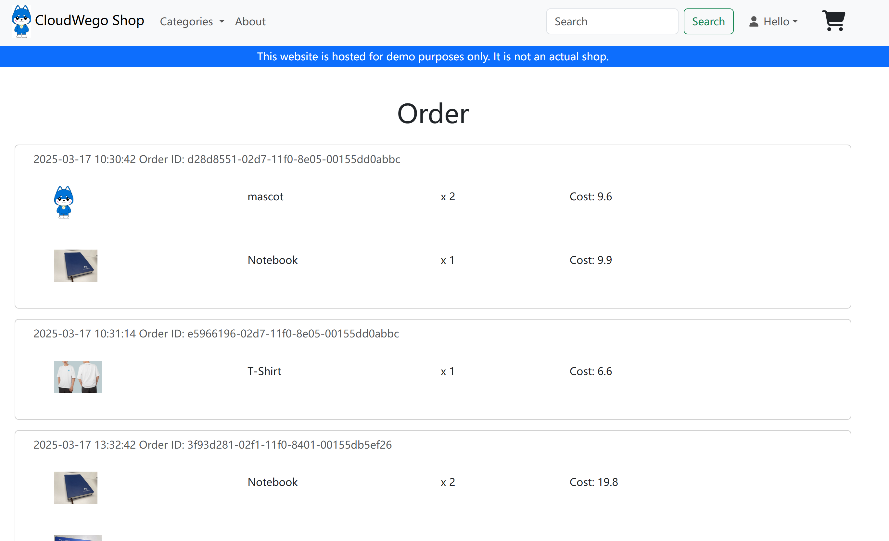
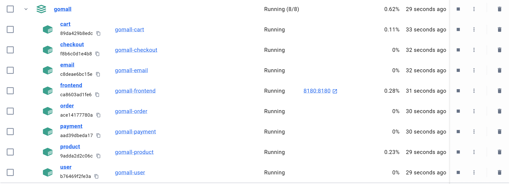
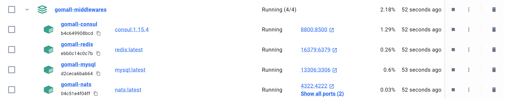
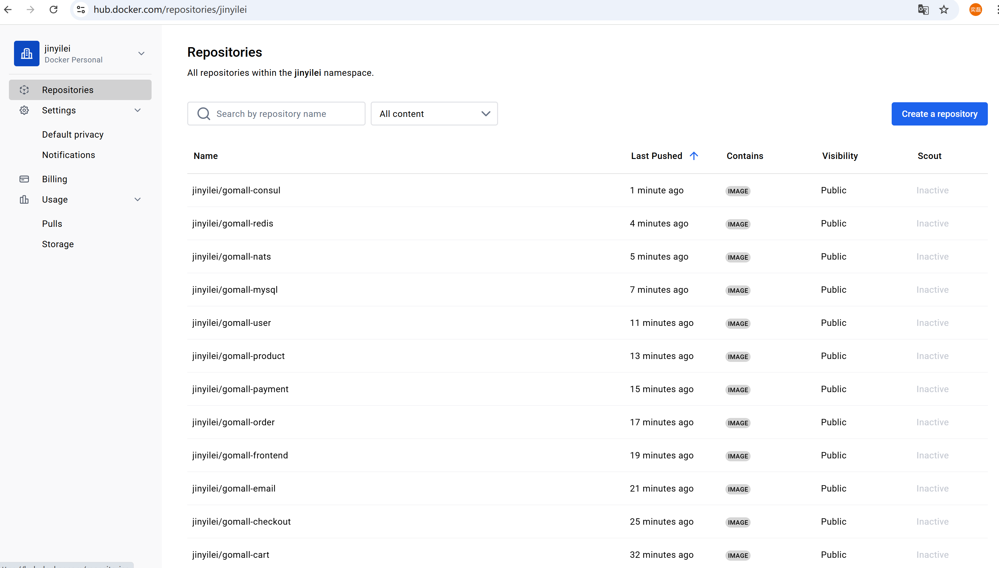

# 云原生软件技术2025 - Lab1：小粒度模块开发与容器技术 - 实验报告
### 第八组 - 金奕磊 陈柏滔 徐行之 曾华正 朱博宇

## 0.说明

### 修改或新增的文件

- 3.1：gomall-middlewares/docker-compose.yaml，中间件，实现数据持久化。
- 3.2：补充代码app/checkout/biz/service/checkout.go, app/order/biz/service/list_order.go, app/order/biz/service/place_order.go
- 3.3：三种不同连接方式的配置写在八个服务的app/xxx/.env, app/xxx/conf/dev/conf.yaml文件中；八个服务各自的app/xxx/Dockerfile
- 3.4：远程镜像仓库地址见4
- 3.5：将rpc_gen复制到这八个服务的文件夹里；修改八个服务的app/xxx/go.mod文件；编排这八个容器并挂载到与中间件同一网络中：docker-compose.yaml；三个windows脚本：create-containers.bat, start-containers.bat, stop-containers.bat用来创建，启动，停止八个容器。

### 三种网络连接方式

- 2.1~2.4：宿主机启动8个服务 + 容器启动4个中间件：127.0.0.1:port  
- 尝试宿主机与容器互通：host.docker.internal:port 
- 3.3~3.5：容器启动8个服务 + 容器启动4个中间件：gomall-xxx:port
- 端口映射 <宿主机:容器>
    - nats：4322:4222
    - redis：16379:6379
    - mysql：13306:3306
    - consul：8800:8500
    - frontend：8180:8180（主机通过localhost:8180访问）

## 1.将数据库中的数据映射到存储卷(或本机文件系统)以实现数据持久化

- 修改gomall-middlewares/docker-compose.yaml
- 在mysql服务下，定义初始化SQL文件和持久化MySQL数据
- 定义持久化卷 mysql_data，用于MySQL数据存储，绑定到容器的 /var/lib/mysql。即使容器销毁，数据也会保存在宿主机的 Docker 卷中而不丢失。
  
```yaml
    volumes:
      - ./db/sql/ini:/docker-entrypoint-initdb.d
      - mysql_data:/var/lib/mysql                 # 映射持久化数据目录

volumes:
  mysql_data:  # 定义持久化卷
```

## 2.开发order和checkout服务

### 修改app/checkout/biz/service/checkout.go

```go
func (s *CheckoutService) Run(req *checkout.CheckoutReq) (resp *checkout.CheckoutResp, err error) {

	// TODO 1.get cart (使用RPC调用Cart服务以获得购物车信息)
	cartResult, err := rpc.CartClient.GetCart(s.ctx, &cart.GetCartReq{UserId: req.UserId})
	if err != nil {
		return nil, kerrors.NewGRPCBizStatusError(114514, "failed to get cart: "+err.Error())
	}
	if cartResult == nil || cartResult.Cart.Items == nil {
		return nil, kerrors.NewGRPCBizStatusError(114514, "your cart is empty!")
	}

	// TODO 2.calc cart（根据第1步的购物车信息，计算总价和订单项信息）
	var (
		total float32
		oi    []*order.OrderItem
	)

	for _, cartItem := range cartResult.Cart.Items {

		// 获取商品信息，RPC调用Product服务
		productResp, err := rpc.ProductClient.GetProduct(s.ctx, &product.GetProductReq{
			Id: cartItem.ProductId,
		})
		if err != nil {
			return nil, kerrors.NewGRPCBizStatusError(114514, "failed to get product info: "+err.Error())
		}
		if productResp.Product == nil {
			continue
		}

		// 计算单项成本
		cost := productResp.Product.Price * float32(cartItem.Quantity)
		total += cost

		// 添加订单项
		oi = append(oi, &order.OrderItem{
			Item: &cart.CartItem{
				ProductId: cartItem.ProductId,
				Quantity:  cartItem.Quantity,
			},
			Cost: cost,
		})

	}

	// TODO 3.create order（根据第1步和第2步的信息，创建order.PlaceOrderReq，并使用RPC调用Order服务创建订单）
	zipcode, _ := strconv.ParseInt(req.Address.ZipCode, 10, 32)
	orderResp, err := rpc.OrderClient.PlaceOrder(s.ctx, &order.PlaceOrderReq{
		UserId: req.UserId,
		Email:  req.Email,
		Address: &order.Address{
			StreetAddress: req.Address.StreetAddress,
			City:          req.Address.City,
			State:         req.Address.State,
			Country:       req.Address.Country,
			ZipCode:       int32(zipcode),
		},
		OrderItems: oi,
	})

	if err != nil {
		return nil, kerrors.NewGRPCBizStatusError(114514, "failed to place order: "+err.Error())
	}
	if orderResp == nil || orderResp.Order == nil {
		return nil, kerrors.NewGRPCBizStatusError(114514, "invalid order response")
	}
	orderId := orderResp.Order.OrderId

	// TODO 4.empty cart（使用RPC调用Cart服务清空购物车）
	_, err = rpc.CartClient.EmptyCart(s.ctx, &cart.EmptyCartReq{UserId: req.UserId})
	if err != nil {
		klog.Warnf("failed to empty cart for user %d: %v", req.UserId, err)
	}

	// TODO 5.pay（使用RPC调用Payment服务进行支付）
	paymentResult, err := rpc.PaymentClient.Charge(s.ctx, &payment.ChargeReq{
		UserId:  req.UserId,
		OrderId: orderId,
		Amount:  total,
		CreditCard: &payment.CreditCardInfo{
			CreditCardNumber:          req.CreditCard.CreditCardNumber,
			CreditCardCvv:             req.CreditCard.CreditCardCvv,
			CreditCardExpirationMonth: req.CreditCard.CreditCardExpirationMonth,
			CreditCardExpirationYear:  req.CreditCard.CreditCardExpirationYear,
		},
	})
	if err != nil {
		return nil, kerrors.NewGRPCBizStatusError(114514, "payment failed: "+err.Error())
	}
	if paymentResult == nil || paymentResult.TransactionId == "" {
		return nil, kerrors.NewGRPCBizStatusError(114514, "invalid payment response")
	}

	// TODO 6.send email（使用MQ发送邮件通知）
	data, _ := proto.Marshal(&email.EmailReq{
		From:        "from@example.com",
		To:          req.Email,
		ContentType: "text/plain",
		Subject:     "You just created an order in CloudWeGo shop",
		Content:     "You just created an order in CloudWeGo shop",
	})
	msg := &nats.Msg{Subject: "email", Data: data}
	err = mq.Nc.PublishMsg(msg)
	if err != nil {
		klog.Error(err.Error())
	}
	klog.Info(paymentResult)

	// TODO 7.finish（返回订单ID和支付结果）
	resp = &checkout.CheckoutResp{
		OrderId:       orderId,
		TransactionId: paymentResult.TransactionId,
	}
	return

}
```

### 修改app/order/biz/service/list_order.go

```go
func (s *ListOrderService) Run(req *order.ListOrderReq) (resp *order.ListOrderResp, err error) {

	// TODO 请实现ListOrder的业务逻辑，从数据库中的order表和order_item表中查询数据
	// 可以参考其他服务的源代码实现这个函数

	// 从数据库中查询用户的订单及订单项数据
	list, err := model.ListOrder(mysql.DB, s.ctx, req.UserId)
	if err != nil {
		return nil, kerrors.NewBizStatusError(514114, err.Error())
	}

	// 订单
	var orders []*order.Order
	for _, v := range list {

		// 预分配订单项切片容量
		items := make([]*order.OrderItem, 0, len(v.OrderItems))
		for _, oi := range v.OrderItems {
			items = append(items, &order.OrderItem{
				Item: &cart.CartItem{
					ProductId: oi.ProductId,
					Quantity:  oi.Quantity,
				},
				Cost: oi.Cost,
			})
		}

		// 构建订单对象，填充收件人及地址信息
		orders = append(orders, &order.Order{
			CreatedAt: int32(v.CreatedAt.Unix()),
			OrderId:   v.OrderId,
			UserId:    v.UserId,
			Email:     v.Consignee.Email,
			Address: &order.Address{
				StreetAddress: v.Consignee.StreetAddress,
				Country:       v.Consignee.Country,
				City:          v.Consignee.City,
				State:         v.Consignee.State,
				ZipCode:       v.Consignee.ZipCode,
			},
			OrderItems: items,
		})
	}

	// 返回订单列表响应
	resp = &order.ListOrderResp{
		Orders: orders,
	}
	return

}
```

### 修改app/order/biz/service/place_order.go

```go
func (s *PlaceOrderService) Run(req *order.PlaceOrderReq) (resp *order.PlaceOrderResp, err error) {

	// TODO 请实现PlaceOrder的业务逻辑，插入数据到数据库中的order表和order_item表，生成一个随机的uuid作为订单号
	// 可以参考其他服务的源代码实现这个函数

	// 校验订单项是否为空
	if len(req.OrderItems) == 0 {
		err = kerrors.NewBizStatusError(191981, "items is empty")
		return
	}

	// 生成唯一的订单号UUID
	orderUUID, err := uuid.NewUUID()
	if err != nil {
		err = fmt.Errorf("failed to generate UUID: %w", err)
		return
	}
	orderId := orderUUID.String()

	// 开启事务，插入订单和订单项数据
	// 使用gorm的事务，确保订单及其订单项插入数据库时保持一致性
	err = mysql.DB.Transaction(func(tx *gorm.DB) error {

		// 构建订单数据
		o := &model.Order{
			OrderId: orderId,
			UserId:  req.UserId,
			Consignee: model.Consignee{
				Email: req.Email,
			},
		}

		// 填充地址信息
		if req.Address != nil {
			a := req.Address
			o.Consignee.StreetAddress = a.StreetAddress
			o.Consignee.City = a.City
			o.Consignee.State = a.State
			o.Consignee.Country = a.Country
		}

		// 插入订单order
		if err := tx.Create(o).Error; err != nil {
			return err
		}

		// 构建订单项数据
		items := make([]model.OrderItem, 0, len(req.OrderItems))
		for _, v := range req.OrderItems {
			items = append(items, model.OrderItem{
				OrderIdRefer: orderId,
				ProductId:    v.Item.ProductId,
				Quantity:     v.Item.Quantity,
				Cost:         v.Cost,
			})
		}

		// 插入订单项order_item
		if err := tx.Create(&items).Error; err != nil {
			return err
		}
		return nil

	})

	// 事务失败时返回业务错误
	if err != nil {
		return nil, kerrors.NewBizStatusError(191981, "place order failed: "+err.Error())
	}

	// 成功返回订单ID
	resp = &order.PlaceOrderResp{
		Order: &order.OrderResult{
			OrderId: orderId,
		},
	}
	return

}
```

### 结果

- 主界面：


- 购物车：



- 订单：



- 支付等待：



- 支付成功：



- 查看历史订单与数据持久化（历史订单与个人账号等数据的存储）



## 3.使用Docker对服务进行容器化

- 这一部分和5：使用Docker Compose编排多个容器可以一起进行
- ***以checkout服务为例*** ，其它七个服务的app/xxx/Dockerfile类似，并相应修改app/xxx/.env和app/xxx/conf/dev/conf.yaml

- Dockerfile:
```Dockerfile
# 使用 Golang 官方镜像作为构建基础
FROM golang:1.21.13-bullseye

# 设置工作目录
WORKDIR /app/checkout

# 将当前目录的所有文件复制到容器的 /app/checkout 目录下
COPY . /app/checkout

# 配置 GOPROXY ，以从国内的代理源拉取依赖
RUN go env -w GOPROXY=https://mirrors.aliyun.com/goproxy/

# 使用 bash 脚本编译服务
RUN bash build.sh

# 设置容器启动时执行的命令
CMD ["bash", "output/bootstrap.sh"]
```

- conf.yaml
	- 127.0.0.1:port(宿主机)：宿主机运行8个服务+容器运行4个中间件
	- host.docker.internal:port(宿主机)：宿主机与容器互通
	- gomall-中间件名:port(容器内)：容器运行8个服务+容器运行4个中间件。将8个服务挂载到与4个中间件相同的网络gomall中，并使用容器内各组件的端口进行通信。
```yaml
kitex:
  service: "checkout"
  address: ":8884"
  metrics_port: ":9994"
  log_level: info
  log_file_name: "log/kitex.log"
  log_max_size: 10
  log_max_age: 3
  log_max_backups: 50

registry:
  registry_address:
    - gomall-consul:8500
    # - host.docker.internal:8800
    # - 127.0.0.1:8800
  username: "abc114514"
  password: "abc114514"

mysql:
  dsn: "gorm:gorm@tcp(gomall-mysql:3306)/gorm?charset=utf8mb4&parseTime=True&loc=Local"
  # dsn: "gorm:gorm@tcp(127.0.0.1:13306)/gorm?charset=utf8mb4&parseTime=True&loc=Local"
  # dsn: "gorm:gorm@tcp(host.docker.internal:13306)/gorm?charset=utf8mb4&parseTime=True&loc=Local"

redis:
  address: "gomall-redis:6379"
  # address: "127.0.0.1:16379"
  # address: "host.docker.internal:16379"
  username: ""
  password: "abc114514"
  db: 0

nats:
  url: "nats://gomall-nats:4222"
  # url: "nats://127.0.0.1:4322"
  # url: "nats://host.docker.internal:4222"
```

- .env
    - 127.0.0.1，host.docker.internal，gomall-xxx含义同上

```yaml
MYSQL_USER=root
MYSQL_PASSWORD=root
MYSQL_HOST=gomall-mysql
# MYSQL_HOST=host.docker.internal
# MYSQL_HOST=127.0.0.1
OTEL_EXPORTER_OTLP_TRACES_ENDPOINT=http://127.0.0.1:4317
# OTEL_EXPORTER_OTLP_TRACES_ENDPOINT=http://host.docker.internal:4317
# OTEL_EXPORTER_OTLP_TRACES_ENDPOINT=http://127.0.0.1:4317
OTEL_EXPORTER_OTLP_INSECURE=true
REGISTRY_ENABLE=true
REGISTRY_ADDR=gomall-consul:8500
# REGISTRY_ADDR=host.docker.internal:8800
# REGISTRY_ADDR=127.0.0.1:8800
```





## 4.将容器推送到远程镜像仓库

- 拉取镜像指令：docker pull jinyilei/gomall-<服务名\>
- 镜像仓库地址：
    -  https://hub.docker.com/repository/docker/jinyilei/gomall-cart
    -  https://hub.docker.com/repository/docker/jinyilei/gomall-checkout
    -  https://hub.docker.com/repository/docker/jinyilei/gomall-email
    -  https://hub.docker.com/repository/docker/jinyilei/gomall-frontend
    -  https://hub.docker.com/repository/docker/jinyilei/gomall-order
    -  https://hub.docker.com/repository/docker/jinyilei/gomall-payment
    -  https://hub.docker.com/repository/docker/jinyilei/gomall-product
    -  https://hub.docker.com/repository/docker/jinyilei/gomall-user
    -  https://hub.docker.com/repository/docker/jinyilei/gomall-consul
    -  https://hub.docker.com/repository/docker/jinyilei/gomall-nats
    -  https://hub.docker.com/repository/docker/jinyilei/gomall-mysql
    -  https://hub.docker.com/repository/docker/jinyilei/gomall-redis



## 5.使用Docker Compose编排多个容器

- 根目录下的docker-compose.yaml文件：
    - services：包含cart,checkout,email,frontend,order,payment,product,user共八个服务
    - container_name：容器名
    - build：构建
        - context：构建目录
        - dockerfile：每个服务的Dockerfile文件
    - network：将服务挂载到gomall网络中
    - environments：部分环境变量，代替.env文件
    - port：宿主机:容器端口映射
    - depend_on：容器间的依赖关系
    - volumes：将宿主机的目录映射到容器中

```yaml
services:
  cart:
    container_name: gomall-cart
    build:
      context: app/cart
      dockerfile: Dockerfile
    networks:
      - gomall
    environment:
      - MYSQL_USER=root
      - MYSQL_PASSWORD=root
      - MYSQL_HOST=gomall-mysql   
    # depends_on:
      # - 
    # ports:
      # - "8883:8883"
      # - "9993:9993"
    # volumes:
      # -

  checkout:
    container_name: gomall-checkout
    build:
      context: app/checkout
      dockerfile: Dockerfile
    networks:
      - gomall
    environment:
      - MYSQL_USER=root
      - MYSQL_PASSWORD=root
      - MYSQL_HOST=gomall-mysql   
      - REGISTRY_ADDR=gomall-consul:8500
    # depends_on:
      # - 
    # ports:
      # - "8884:8884"
      # - "9994:9994"
    # volumes:
      # -

  email:
    container_name: gomall-email
    build:
      context: app/email
      dockerfile: Dockerfile
    networks:
      - gomall
    # environment:
      # -
    # depends_on:
      # - 
    # ports:
      # - 8888:8888
    # volumes:
      # -

  frontend:
    container_name: gomall-frontend
    build:
      context: app/frontend
      dockerfile: Dockerfile
    networks:
      - gomall
    ports:
      - 8180:8180
      # - 8090:8090
    # environment:
      # -
    # depends_on:
      # - 
    # volumes:
      # -
      
  order:
    container_name: gomall-order
    build:
      context: app/order
      dockerfile: Dockerfile
    networks:
      - gomall
    environment:
      - MYSQL_USER=root
      - MYSQL_PASSWORD=root
      - MYSQL_HOST=gomall-mysql
      - REGISTRY_ADDR=gomall-consul:8500
    # ports:
      # - 8885:8885
      # - 9995:9995  
    # depends_on:
      # - 
    # volumes:
      # -

  payment:
    container_name: gomall-payment
    build:
      context: app/payment
      dockerfile: Dockerfile
    networks:
      - gomall
    environment:
      - MYSQL_USER=root
      - MYSQL_PASSWORD=root
      - MYSQL_HOST=gomall-mysql   
    # ports:
      # - 8886:8886
      # - 9996:9996  
    # depends_on:
      # - 
    # volumes:
      # -

  product:
    container_name: gomall-product
    build:
      context: app/product
      dockerfile: Dockerfile
    networks:
      - gomall
    environment:
      - MYSQL_USER=root
      - MYSQL_PASSWORD=root
      - MYSQL_HOST=gomall-mysql
      - REGISTRY_ADDR=gomall-consul:8500   
    # ports:
      # - 8881:8881
      # - 9991:9991  
    # depends_on:
      # - 
    # volumes:
      # -
      
  user:
    container_name: gomall-user
    build:
      context: app/user
      dockerfile: Dockerfile
    networks:
      - gomall
    environment:
      - MYSQL_USER=root
      - MYSQL_PASSWORD=root
      - MYSQL_HOST=gomall-mysql   
    # ports:
      # - 8882:8882
      # - 9992:9992  
    # depends_on:
      # - 
    # volumes:
      # -

networks:
  gomall:
    external: true

# volumes:
```

- 将rpc_gen目录复制到每个服务的文件夹里，并修改go.mod以找到该目录

```go
// replace github.com/cloudwego/biz-demo/gomall/rpc_gen => ../../rpc_gen
replace github.com/cloudwego/biz-demo/gomall/rpc_gen => ./rpc_gen
```

- 一些辅助.bat脚本（以frontend服务为例，其它的类似）
```bat
REM 创建容器
@echo off
echo Creating gomall-frontend
docker run -it --network=gomall -p 8180:8180 --name=gomall-frontend gomall-frontend /app/frontend/output/bin/frontend
docker stop gomall-frontend
...

REM 启动容器
echo Starting gomall-frontend...
docker start gomall-frontend
...

REM 停止容器
echo Stopping gomall-frontend...
docker stop gomall-frontend
...
```

## 6.小组成员分工

- 金奕磊（组长）：完善order和checkout服务的代码；实现Docker Compose编排；推送镜像到远程镜像仓库；集成并测试容器的正常运行。
- 陈柏滔：宿主机编译并运行服务；完善order和checkout服务的代码；实现服务的容器化；实现MySQL数据持久化。
- 徐行之：宿主机编译并运行服务；完善order和checkout服务的代码；实现Docker Compose编排。
- 曾华正：宿主机编译并运行服务；完善order和checkout服务的代码；实现服务的容器化；撰写实验报告。
- 朱博宇：宿主机编译并运行服务；完善order和checkout服务的代码；实现服务的容器化；撰写实验报告。
